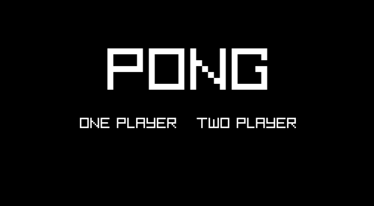
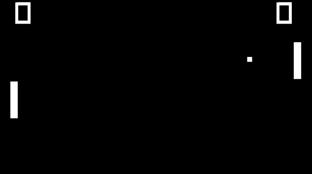

# Pong (C++ & Raylib)

A classic **Pong** game built in **C++** using the **raylib** library for graphics.  
Includes both **2-player mode** and **single-player** mode.

## 🎮 Gameplay Modes
- **Single Player:** Play against an AI
- **Two Players:** Local 1v1 on the same keyboard

## ✨ Features
- Real-time paddle movement and responsive controls
- Ball physics + wall/paddle collision detection
- Different behaviours of ball based on the collision placement
- Score tracking
- Simple mode selection in menu

## 🛠 Technical Highlights
- **C++**
- **raylib**
- **Visual Studio** (Windows)
- **Ableton** to produce sound effects

## 📸 Screenshots

### Main Menu



### Gameplay Interface



## 🚀 Build & Run (Windows)

### Install raylib via vcpkg
1. Install **vcpkg** (Microsoft C/C++ package manager)
2. Install raylib:
   ```bash
   .\vcpkg install raylib
   .\vcpkg integrate install

## 🎯 Controls
- First player always controls the paddle with W and S keys to go up and down respectively.
- If the game mode is two players, the second player moves their paddle with up and down arrow keys.
- To exit the game, simply press the escape key.

## 📚 What I Learned
- Implementing a real-time game loop
- Collision handling, and basic physics
- Programming a C++ project and using an external library
- Designing AI behaviour